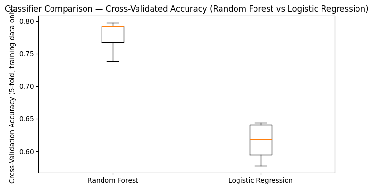
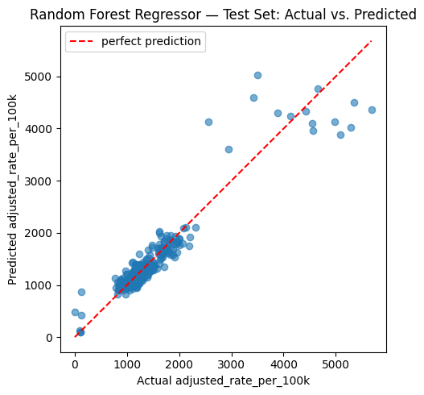
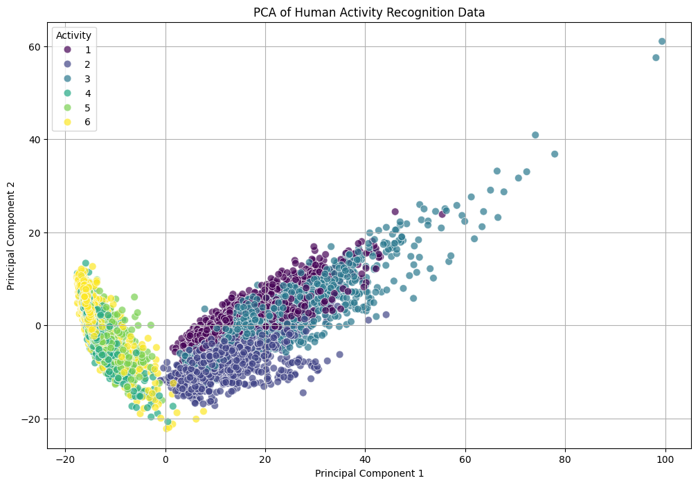
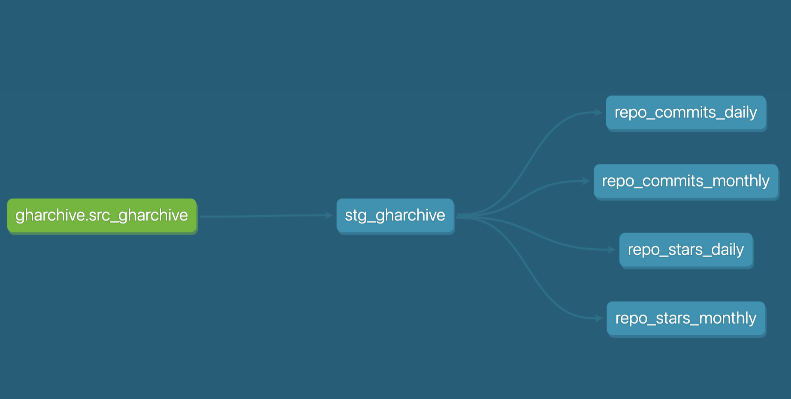
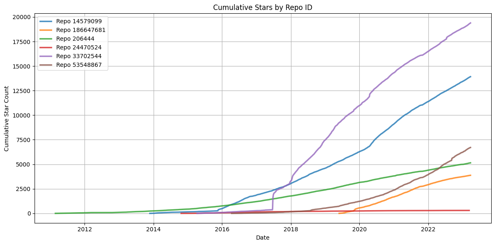
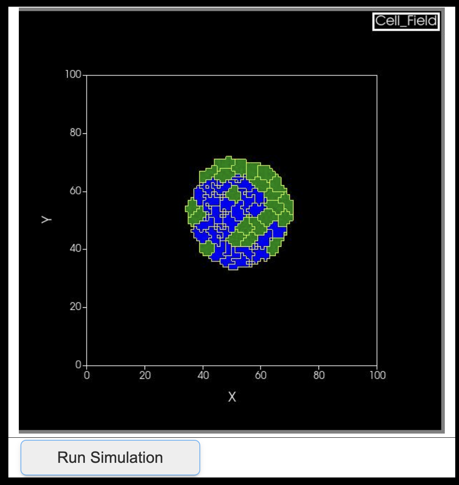
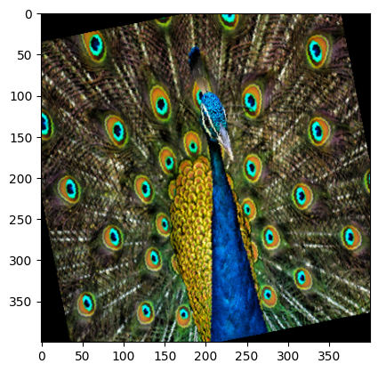

Jinyao Huang · a portfolio
================

    

I present here a sample of my projects and coursework. Contact me on [LinkedIn](https://www.linkedin.com/in/jinyao0004/).

## Machine learning for social good

**LA Safety Navigator**: a Random Forest model predicting perceived walking safety across Los
Angeles neighborhoods from historical crime patterns, adjusted for underreporting and population,
and deployed as an interactive Streamlit app that scores an address or suggests a lower-risk route.
Code in [Repository](https://github.com/Jinyao-huang/AI4ALL-safety-navigator).

Built as part of the **AI4ALL** program. The classifier reaches 77.8% cross-validated accuracy
predicting a neighborhood's Low/Medium/High safety tier, ahead of a Logistic Regression baseline.

**Keywords**: Random Forest, geospatial analysis, feature engineering, Streamlit

## Data analysis & exploration

**Twitter Customer Service Response**: an EDA over ~2.8M customer-support tweets comparing how
Amazon and Apple handle support on Twitter — response time, inbound volume, and satisfaction rate.
Code in [Repository](https://github.com/Jinyao-huang/twitter-customer-response-analysis).

**Clustering — UCI Human Activity Recognition**: an ongoing unsupervised-learning exploration
recovering six smartphone-sensor activity classes with PCA, K-Means, and t-SNE. Code in
[Repository](https://github.com/Jinyao-huang/clustering-uci-har).

## Data engineering

**GitHub Activity Pipeline**: an ETL pipeline over GH Archive data tracking repository growth —
stars and commit velocity — through a dbt transformation layer into a queryable SQL format. Code in
[Repository](https://github.com/Jinyao-huang/Github-pipeline).

**Keywords**: ETL, dbt, data modeling

## Open-source contribution — CompuCell3D

An interactive Jupyter widget for configuring [CompuCell3D](https://compucell3d.org/) — an
open-source multiscale virtual-tissue simulation environment — through a visual interface instead
of hand-written specification scripts, built with Dr. T.J. Sego and Steve Han. Code in
[Repository](https://github.com/Jinyao-huang/CompuCell3D/tree/master/CompuCellJupyterInterfaceDevelopment).

**Keywords**: scientific computing, Jupyter widgets, simulation

## Coursework

**ML @ Berkeley**: notebooks from an introductory deep-learning course adapted from Stanford's
CS231N — PyTorch fundamentals, autograd, datasets, and three ways to build a network. Code in
[Repository](https://github.com/Jinyao-huang/ml-at-berkeley).

## Other projects

**Colored ASCII-Art Steganography**: a Streamlit engine that hides a secret message inside the
*character identity* of a colored ASCII-art rendering, chosen via constrained-optimization
character selection. Code in [Repository](https://github.com/Jinyao-huang/ASCII).

**Keywords**: steganography, constrained optimization, image processing
